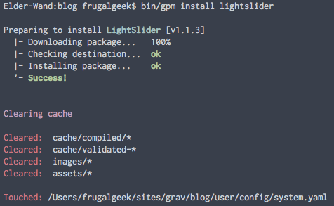

# Grav LightSlider Plugin


`lightslider` is a [Grav](http://github.com/getgrav/grav) plugin that adds a lightweight, responsive slider.
It uses the jQuery plugin [lightslider](http://sachinchoolur.github.io/lightslider/), hence the name.

# Installation

Installing the LightSlider plugin can be done in one of two ways. Our GPM (Grav Package Manager) installation method enables you to quickly and easily install the plugin with a simple terminal command, while the manual method enables you to do so via a zip file. 

## GPM Installation (Preferred)



The simplest way to install this plugin is via the [Grav Package Manager (GPM)](http://learn.getgrav.org/advanced/grav-gpm) through your system's Terminal (also called the command line).  From the root of your Grav install type:

    bin/gpm install lightslider

This will install the LightSlider plugin into your `/user/plugins` directory within Grav. Its files can be found under `/your/site/grav/user/plugins/lightslider`.

## Manual Installation

To install this plugin, just download the zip version of this repository and unzip it under `/your/site/grav/user/plugins`. Then, rename the folder to `lightslider`. You can find these files either on [GitHub](https://github.com/getgrav/grav-plugin-lightslider) or via [GetGrav.org](http://getgrav.org/downloads/plugins#extras).

You should now have all the plugin files under

	/your/site/grav/user/plugins/lightslider

>> NOTE: This plugin is a modular component for Grav which requires [Grav](http://github.com/getgrav/grav), the [Error](https://github.com/getgrav/grav-plugin-error) and [Problems](https://github.com/getgrav/grav-plugin-problems) plugins, and a theme to be installed in order to operate.

# Usage

To best understand how lightSlider works, you should read through the original project [documentation](http://sachinchoolur.github.io/lightslider/settings.html).

This plugin is intended to be used as a [modular page](http://learn.getgrav.org/content/content-pages#modular-page) within Grav. That modular page created should be called `lightslider.md` so that it will automatically use the lightslider twig template already provided in the plugin.

The lightslider template automatically looks for filesname of the format: `image-1.jpg`, `image-2.jpg`, `image-3.jpg`, etc. It will associate each section of the page content to each image in order.  

From your page headers, you can then tweak almost all the settings that lightslider comes with. 

eg:

```
---
title: Slider Content
routable: false
visible: false
lightslider:
    #min_height: 290px;
    height: 280px;
    brightness: -100
    mode: 'slide'
    pager: 'true'
    controls: 'true'
    keyPress: 'true'
    pause: 2000
    speed: 1000
    auto: 'true'
    loop: 'true'
---

# Shop Geek Stuff
## We have all your **geek** needs covered..
___
# SnipCart Powered
## **Grav** plus **SnipCart** equals easy shopping
___
# A Huge Variety
## A great selection of **bits** and **bobs**
```

This page has 3 sections defined by the `___` separator. Each section will be associated with an image provided alongside this `lightslider.md` file.  For example the first section will be displayed on top of `image-1.jpg` image file.

> Note: If you want to see this plugin in action, have a look at our [Shop Site Skeleton](http://github.com/grav/grav-skeleton-shop-site/archive/master.zip) 

# Updating

As development for LightSlider continues, new versions may become available that add additional features and functionality, improve compatibility with newer Grav releases, and generally provide a better user experience. Updating LightSlider is easy, and can be done through Grav's GPM system, as well as manually.

## GPM Update (Preferred)

The simplest way to update this plugin is via the [Grav Package Manager (GPM)](http://learn.getgrav.org/advanced/grav-gpm). You can do this with this by navigating to the root directory of your Grav install using your system's Terminal (also called command line) and typing the following:

    bin/gpm update lightslider

This command will check your Grav install to see if your LightSlider plugin is due for an update. If a newer release is found, you will be asked whether or not you wish to update. To continue, type `y` and hit enter. The plugin will automatically update and clear Grav's cache.

## Manual Update

Manually updating LightSlider is pretty simple. You would follow all of the steps listed for the manual installation above, but you will need to delete the existing `lightslider` folder found under `/your/site/grav/user/plugins/` first. 

> Note: Any changes you have made to any of the files listed under this directory will also be removed and replaced by the new set. Any files located elsewhere (for example a YAML settings file placed in `user/config/plugins`) will remain intact.